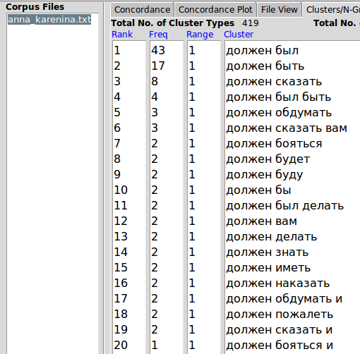
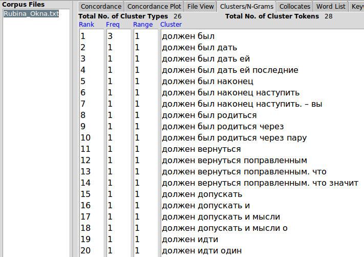

# HW 6
### Задание I.
1.

2.

3.

**Вывод: Пользуясь программой, я могла выявить более популярное слово из синонимичной пары.Кроме того, можно было заметить и примерное время появления метро, так как график отразил возникновение слова.** 

### Задание II. 
В качестве второго текста я выбрала сборник рассказов Дины Рубиной “Окна”.
а) Самые популярные слова в “Анне Карениной” – И, Не, Что, В, Он. В “Окнах” – И,  В, На, Не, Что. Это можно объяснить тем, что служебные части речи (союзы, предлоги, частицы) универсальны и необходимы для связи самостоятельных частей речи. А местоимения получают свое значение в контексте и могут быть "разными лицами" по смысловому значению.

б) используя start > invert order

Я выбрала следующие слова: _должен_, _грех_ и _принять_.
Слово должен в “Анне Карениной” гораздо чаще встречается в форме конструкций типа _должен сказать_ и _должен спросить_, причём чаще от первого лица. В “Окнах” же _должен_ чаще используется в фразах вроде _он должен понимать_, что говорит о том, что первое произведение уделяет большее значение теме долга и ответственности. 

В “Окнах” слово _грех_ в основном встречается в устойчивых словосочетаниях типа _чего греха таить_ и _от греха подальше_; в “Анне Карениной” же это слово используется в прямом смысле, например _грех уже искуплен_ или _у тебя грехов немного_. Это можно объяснить тем, что в "Анне Карениной" большее значение придаётся вопросам морали.

В “Окнах” принять встречается в фразах вида _принять во внимание_ или _принимали за свет фонарей_, в “Анне Карениной” в основном встречаются фразы вида _принять подарок_ или _не мог принять этого_. Можно сделать вывод, что Л. Толстой чаще использует слово принять в его первом значении.

г)

> Частота слова _принять_ в двух книгах

> Частота слова _грех_

> Частота слова _должен_ (с учётом чередования должн-)

д)

В обоих текстах наиболее часто встречается сочетание "должен был" У Рубиной слово "должен" выступает и в значении степени уверенности, у Толстого больше с связи с обязанностями человека.

е)
### Вывод
Подобранные сочетания позволяют делать выводы об индивидуальном стиле автора и о чертах, характерных для эпохи в целом. Литература Толстого часто поднимает социальные темы,общечеловеческие вопросы, фразы построены более сложно, предложение состоит из большего количества слов. Для современной нам Рубиной более характерна лаконичность, легко читаемый текст.
